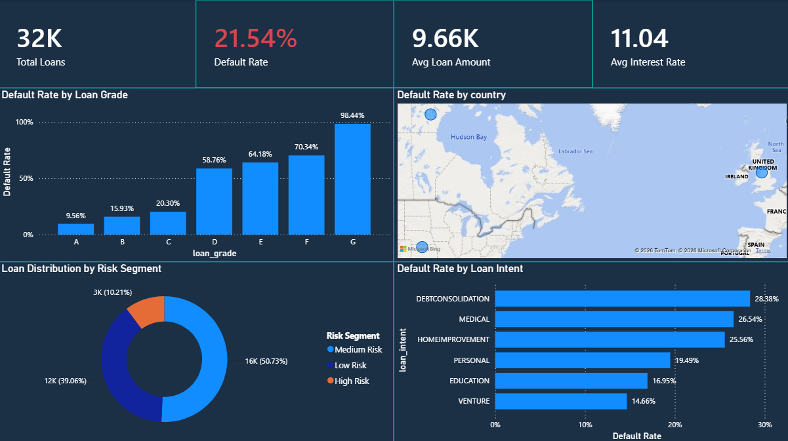
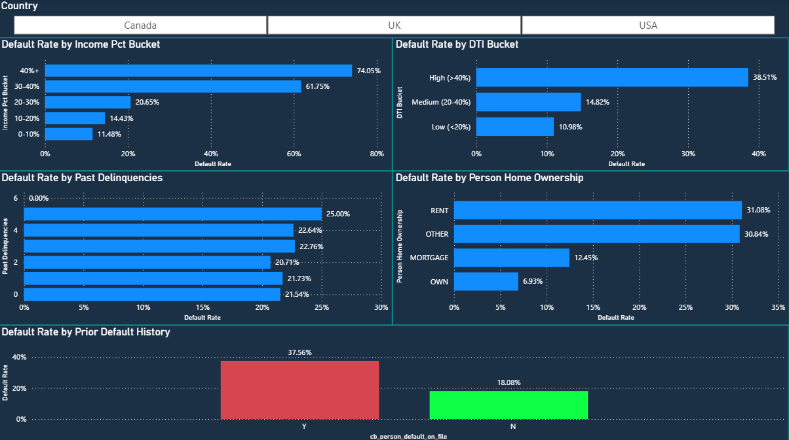
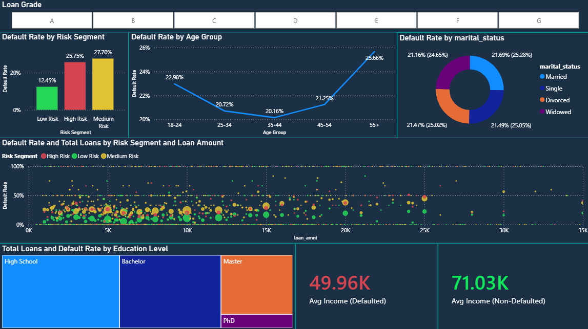
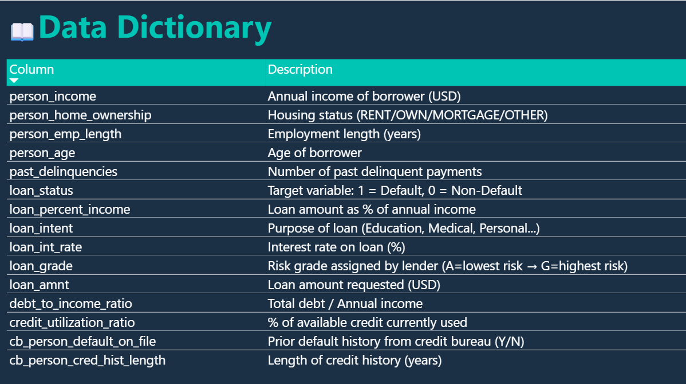

# Credit-Risk-Analysis
A data analytics project analyzing credit risk for Nova Bank. The goal is to identify loan default patterns, understand borrower behaviors, and optimize lending decisions to balance financial risk with credit accessibility across the US, UK, and Canada.

## 📊 Khám phá Dữ liệu & Business Insights (Power BI)

Dựa trên tập dữ liệu gồm 32K hồ sơ vay, tôi đã xây dựng hệ thống Dashboard tương tác để phân tích rủi ro tín dụng. Tỷ lệ nợ xấu (Default Rate) trung bình của toàn hệ thống đang ở mức **21.54%**. 

Dưới đây là những phát hiện quan trọng nhất (Key Insights) để giúp Nova Bank tối ưu hóa quyết định cho vay:

### 1. Phân loại rủi ro (Risk Drivers)
* **Tỷ lệ khoản vay trên thu nhập (Income Pct Bucket) là yếu tố quyết định lớn nhất:** Những khách hàng vay số tiền chiếm hơn 40% thu nhập hàng năm của họ có tỷ lệ vỡ nợ cao bùng nổ lên tới **74.05%**.
* **Lịch sử tín dụng và Tình trạng nhà ở:** Khách hàng đi thuê nhà (Rent) có rủi ro vỡ nợ cao gấp gần 5 lần so với những người đã sở hữu nhà (Own). Đồng thời, những người từng có tiền sử vỡ nợ (Prior Default History) có tỷ lệ rủi ro cao gấp đôi (37.56% so với 18.08%).
* **Mục đích vay:** Các khoản vay dùng để Đảo nợ (Debt Consolidation) và Y tế (Medical) tiềm ẩn rủi ro cao nhất (trên 26%), trong khi vay để Khởi nghiệp (Venture) lại an toàn nhất.

### 2. Hồ sơ khách hàng (Borrower Profile)
* **Khoảng cách thu nhập:** Khách hàng thanh toán tốt có mức thu nhập trung bình ($71.03K) cao hơn đáng kể so với nhóm vỡ nợ ($49.96K).
* **Độ tuổi:** Rủi ro tín dụng tạo thành một đường cong hình chữ U theo độ tuổi. Nhóm khách hàng trẻ (18-24 tuổi) và nhóm lớn tuổi (trên 55 tuổi) có tỷ lệ vỡ nợ cao nhất (trên 22%), trong khi nhóm trung niên (35-44 tuổi) lại là tệp khách hàng an toàn nhất.

---

## 📷 Giao diện Dashboard

### 1. Tổng quan hệ thống (Overview)
Cung cấp góc nhìn toàn cảnh về các chỉ số KPI cốt lõi, tỷ lệ nợ xấu theo xếp hạng khoản vay (Loan Grade) và phân bổ địa lý. Có thể thấy sự tương quan tuyệt đối: Loan Grade càng thấp (tiến về G), tỷ lệ vỡ nợ càng tiệm cận 100%.

### 2. Phân tích Yếu tố Rủi ro (Risk Drivers)
Đi sâu vào các biến số tài chính của cá nhân như DTI, tỷ lệ khoản vay/thu nhập, và lịch sử trễ hạn để tìm ra chân dung khách hàng dễ vỡ nợ nhất.

### 3. Hồ sơ Nhân khẩu học (Borrower Profile)
Phân tích hành vi trả nợ dựa trên các yếu tố nhân khẩu học như độ tuổi, tình trạng hôn nhân, trình độ học vấn và mức thu nhập trung bình.

### 4. Từ điển Dữ liệu (Data Dictionary)
Bảng tra cứu chi tiết ý nghĩa của từng trường dữ liệu được sử dụng trong mô hình phân tích.

---

### 📂 File gốc Power BI & Báo cáo
* 👉 Tải xuống và trải nghiệm Dashboard tương tác (File .pbix): [credit_risk.pbix](./dashboards/credit_risk.pbix)
* 📄 Xem nhanh báo cáo toàn cảnh định dạng PDF: [credit_risk.pdf](./dashboards/credit_risk.pdf)
